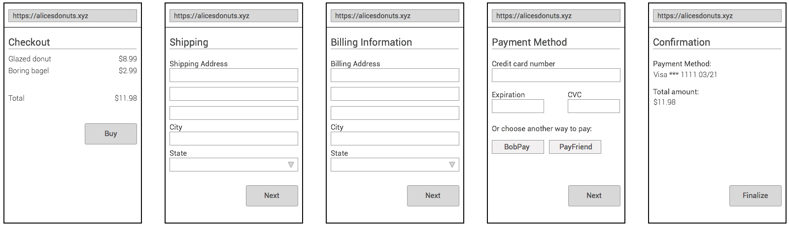
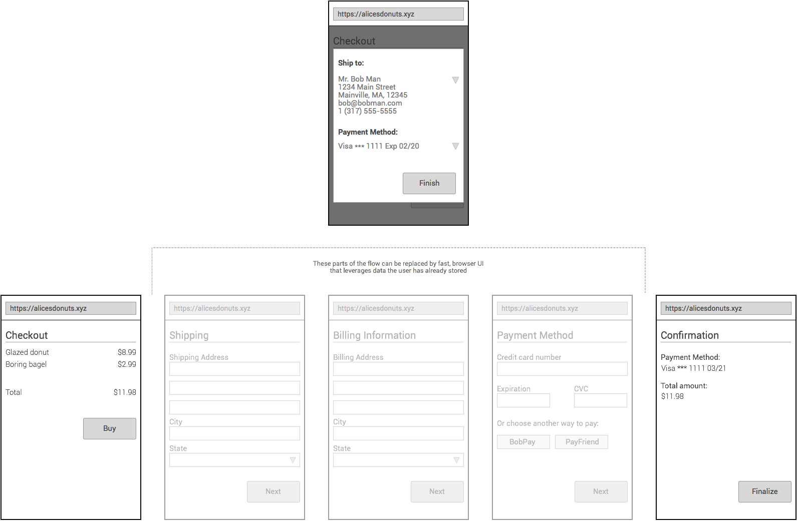

# Why PaymentRequest

### Intro

This document is an attempt to try and provide an explanation for why the PaymentRequest API is structured the way it is and our goals in choosing such a direction. As is usually the case, it is most helpful to start from a problem statement, for which we actually have two (in order of importance):

1. It is too difficult to buy things on the web. Checkout flows are long and cumbersome, requiring users to fill out the same subset of information over and over again. This problem has become substantially more acute with the growth of the mobile web, where users are forced to input this repetetive information on small, virtual keyboards. The web needs a better option.

2. Transmitting raw credit card numbers to make a purchase requires users to take on unnecessary risk. The web remains one of the last places where it is commonplace to transmit raw credit cards numbers to make a transaction. While the majority of purchases in physical environments take advantage of tokenization, the web does not yet have a clear, viable path to tokenization. 

Our plan is to take an iterative approach in addressing these core problems. We don't expect to solve every problem or address every payment use case in the first version. This means there will be some checkout flows or payment systems we might not be able to support. That's okay. We want to start simple and address the core use cases that represent the majority of transactions for consumers: the purchase of physical and digital goods.

Starting small like this also encourages support across all major browsers, something we see as critical for the adoption of this API. Merchants are very careful about updating their purchasing flow - and rightfully so - so it's important that calling paymentRequest produces a consistent experience for users across platforms and channels. Starting small lowers the barrier for entry for both merchants and browsers.

In light of this, we've made decisions in this API that may sacrifice some measure of extensbility for providing immediate value now. This was intentional. Alex Russell, W3C TAG Member, recently gave a speech at the Extensible Web Summit in Melbourne in which he [speaks to this very topic](https://infrequently.org/2016/01/ews-melbourne/) and sums up our approach:

> My specific goal, then, is to improve the rate of progress on the web for the benefit of users and developers, in that order.

> Put another way, I want to ensure the web is the platform developers invest in first and most, and that they do so because it’s the easiest, best way to deliver great experiences.

> ...

> There will be new features that aren’t extensible by default. That’s OK. Not ideal, but OK and, sometimes, unavoidable. What is avoidable is leaving the web’s features sealed shut, never asking the questions about how things relate; never connecting the dots.

### Building a Better Experience

The majority of checkout experiences across the web function the same. They take the user through a 4-5 step checkout flow and request the same subset of information over and over again (name, shipping address, email, etc). Worse yet, these multiple steps are usually spread out across multiple pages, which can be painful for users on slower or unreliable connections. Websites try to solve this problem by asking users to create an account, but this doesn't help new users or users who are only interested in making a single purchase.

(Common checkout flow today)

Browsers, however, are in a special position to be able to solve this problem. Unlike websites, browsers aren't bound by origin and thus can store information about users that can be used across multiple origins. By calling PaymentRequest, then, a merchant is effectively asking the browser to collect the critical information necessary to complete a transaction. In the best case, browsers can leverage information they already have stored for users. In the worst case, browsers can provide fast, native UI for collecting this information before passing it back to the merchant in a JSON blob.

This new flow we've enabled could look something like this:

By letting the browser leverage information it already had about the user (shipping address preferences, contact information, and even payment credentials), users can move through flows much faster and with much less difficulty.

### Safer transactions on the web

PaymentRequest, however, isn't just about improving the user experience. It's also about trying to improve the state of payments on the web by removing the need to transmit raw credit cards to merchants. This protects users in the event of a data breach and limits the amount of liability merchants need to assume.

This is a complicated space, and one where there isn't yet a clear answer for "How do I tokenize a given credit card". While there is some mention of how this could work on the web in [EMVCo's Tokenization Specification](https://www.emvco.com/specifications.aspx?id=263), we're probably some years off from an open solution.

Thankfully, there are already new payment apps that have emerged in the last few years that leverage tokenization (e.g. Apple Pay, Android Pay, Samsung Pay, etc). How can we bring these into the web platform?

This highlights the second unique position of browsers compared to websites: Browsers are native apps. And as native apps, they have access to all the core, system-level APIs that are necessary to bring these new payment methods into the web platform.

PaymentRequest is designed to let the browser act as a "middle man" between merchants and payment apps, no matter what that payment app is or the method of payment chosen (even bitcoin!).

This allows for payment app providers to innovate and create the best experience for both merchants and users, futher improving payments on the web.

### On Flexibility

Lastly, it's worth mentioning flexibility. We recognize that not every merchant is ready to give up full control of their flow to collect user information. Maybe they just want to quickly get payment credentials. Or maybe they just want to support a new payment method not available in the browser.

This is all possible with PaymentRequest. It can be used for the whole checkout flow or just a single part. And because the browser doesn't ever communicate directly with payment processors (we just pass back data), merchants are still free to design flows how they want.

Our hope is that this API is a starting point. A way to provide immediate value to a problem where a solution is sorely needed, as well as a way to begin the conversation to better understand the needs of merchants and developers.

Feedback is not only welcome, but encouraged.

### On Privacy

Protecting user data and ensuring that it is only shared with merchants via the consent of the user is incredibly important to us. So while it is possible that we could implement a payment system with less friction, whereby information is automatically shared with the merchants requesting it, we don't think this is in the best interest of users. This is why PaymentRequest is designed to always invoke UI.

### FAQ

**Wasn't something like this tried before with requestAutocomplete? Why a new API? What's different now?**

RequestAutocomplete was a good starting point, but it had a few limitations:

1. It was designed to only work with credit cards. This is great for some regions, but it doesn't work well in demographics where credit cards are not the primary form of payment.
2. It didn't provide a great mechanism to address the problem of removing raw credit card numbers from the ecosystem. It also didn't allow us to bring newer forms of payment that leverage strong device authentication (e.g. Apple Pay, Android Pay, Samsung Pay, etc) into the web platform.
3. It failed to get much cross-browser traction, most likely due to the issues above as well ecosystem challenges.

PaymentRequest addresses the issues above and has been a collaborative effort from the beginning. We hope that a combination of cross-browser adoption along with the recent rapid rate of progress in the payments ecosystem will alow us to fundamentally improve payments on the web plaform.

**Why collect shipping addresses but not things like coupon codes, loyalty cards, etc?**

This goes back to the idea of starting simple and taking an iterative approach with this API. Things like loyalty cards and coupons are an important part of the checkout process, but they aren't *essential.* Shipping information, however, is a fundamental part of every checkout flow that involves the purchase of a physical good. Furthermore, if our goal, as stated above, is to fundamentally improve the checkout experience on the web, we can't just optimize the final step of the checkout flow (i.e. the collection of payment information).

In the future, based on feedback from merchants and developers, we may add support for coupon codes, loyalty cards, and more.